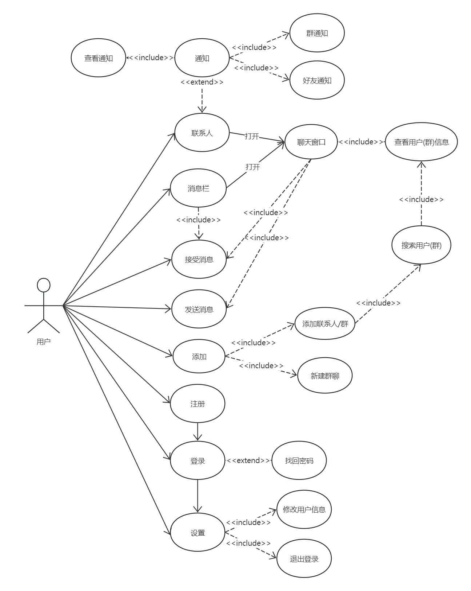

## 1、项目可行性分析

### 1.1 技术可行性分析

在技术方面，我们采用了以下架构和工具：

- **操作系统**：前端开发使用 Windows 10 或更新版本，后端开发使用 Linux。
- **前端开发工具**：我们选择了 Qt 6.6.0 进行桌面图形开发。
- **代码同步工具**：我们使用 Git 进行代码的组织和同步。
- **数据库**：我们使用 MySQL 进行数据存储与管理。
- **后端语言**：我们使用 Python 进行后台系统和接口的构建。
- **计算机网络架构**：使用经典的客户端/服务器（C/S）模型。
- **网络通信**：前后端通信采用 Socket，并使用 JSON 进行数据交换。

这些技术和开发工具都是比较简单的或者在学校中有所接触了解，具体优势及选择原因：

- **Windows桌面系统**：作为用户量最大的桌面操作系统，使用上没有太大问题。
- **Linux桌面系统**：桌面版的Linux系统(Ubuntu)提供图像界面，更易使用，也方便作为本地服务器进行测试
- **Linux服务器**：可看作只有终端的Linux桌面系统，学习一些基础指令即可完成大部分功能。
- **Qt**：具有图形化UI界面，在基础控件的使用上与cocos2d-x相似，且具有详细规范的开发文档与学习资源，学习起来很容易上手。
- **MySQL**：具有较高的性能和稳定性，此外它支持跨平台操作，可以在各种操作系统上运行
- **Python**：具有简单易学、代码简洁、生态丰富等优点。
- **Socket**：通过Socket，前后端可以方便地进行数据交换和通信。
- **Git**：操作简单，易于理解，可以有效地管理多人的开发过程，确保代码的组织和同步，且大部分现代IDE都有提供Git图形操作界面。
- **JSON**：作为轻量级的数据交换格式，JSON易于人的阅读和编写，且大多数语言都有解析JSON的模块或者第三方库，可以方便的在多种语言之间进行数据交换。

综上所述，我们认为这些技术的选择可以使得开发过程具有较低的难度和阻力，并且可以辅助使用 ChatGPT 进行开发，从技术层面来看是可行的。

### 1.2 经济可行性分析
“MyChat”聊天软件的开发中虽然使用了适合Windows的免费开发系统和工具，减少了初期的技术投入，但由于软件预定要公网上线，我们需要考虑到额外的成本，包括服务器的费用，以及确保数据加密和用户隐私保护的相关开支。由于“MyChat”仅支持Windows平台，这简化了开发流程并减少了需要为多个操作系统进行适配和测试的成本。然而，我们仍需进行充分的测试以确保软件在Windows环境下的稳定性和性能。

**开发成本分析表**

| 项目     | 费用               |
| :------- | :----------------- |
| 软件投入 | ¥0          |
| 硬件投入 | ¥2,2500    |
| 系统开发 | ¥0         |
| 运行维护 | ¥2000/户   |
| 成本总计 | ¥2,4500    |

**收益分析表**

| 项目         | 收益                |
| :----------- | :----------------- |
| 软件费用      | ¥6000 /套|
| 每年维护费用  | ¥3000 /年 |
| 广告费用      | ¥？      |
| 收益总计      | ¥？      |

**分析说明：**

**开发成本：**

- **软件投入**：开源软件以及免费软件。
- **硬件投入**：用于测试和开发的服务器和设备,需要服务器和对应的windows的设备进行软件测试，确保稳定性。
- **系统开发**：软件开发人员和用户界面设计人员来构建和完善软件，确保用户体验。
- **运行维护**：包括服务器租用费、软件更新、技术支持和数据备份等费用。

**收益：**

- **软件费用**：用户支付一次费用，获得软件的永久使用权。
- **广告收入**：通过软件内广告来生成收入，这部分收益依赖于用户的活跃度和广告策略的效果。
- **每年维护费用**：服务器费用，数据备份和恢复，软件升级和补丁以及技术支持。

从长期来看，如果"MyChat"能够吸引足够数量的用户，并有效地管理运营成本，项目的经济可行性将是正面的。然而，要达到盈利状态，项目团队需要有效地执行市场推广策略，持续增加用户基础，并优化收益模型。

### 1.3 操作可行性分析

#### 1.3.1 团队能力与资源配置

针对“MyChat”项目，我们的团队结构和资源配置如下：

- **开发团队**：我们团队由艾雪飞，曹志强，靳有田和张广奇分别担任软件工程师、UI/UX设计师、数据库管理师和项目经理的角色。
- **资源配置**：团队配备了开发过程中所需的计算机设备和必要的软件工具，包括服务器、数据库管理系统及开发环境等。
- **人力资源管理**：通过明确的角色划分和任务分配，确保各成员能在其专长领域内发挥最大效率。

#### 1.3.2 时间管理与项目调度

- **项目时间表**：项目划分为需求分析、系统设计、实现、测试和部署等阶段。每个阶段都有明确的起止时间和里程碑任务，确保项目按时完成。
- **迭代开发**：采用敏捷开发模式，分阶段完成需求实现和测试，快速响应需求变化和市场反馈，有效提高项目的适应性和成功率。

#### 1.3.3 技术支持与维护

- **技术支持**：建立完善的用户支持系统，包括在线帮助文档、FAQ、客户服务热线和邮件回复等，确保用户在使用过程中遇到的问题能够得到及时解决。
- **系统维护**：定期对软件进行更新和维护，修复可能出现的安全漏洞，提升系统稳定性和性能。

#### 1.3.4 风险管理与应对策略

- **风险识别与评估**：定期进行项目风险评估，包括技术风险、市场风险和操作风险，通过专业的风险管理工具和方法来监控风险。
- **应对措施**：为每一种潜在的风险制定具体的应对策略。例如，对于技术风险，可以通过技术预研和原型测试来降低其影响；对于市场风险，则通过市场调研和营销策略调整来应对。

综上所述，"MyChat"项目的操作可行性较高。团队具备完成项目所需的技术力量和管理经验，资源配置充足，时间管理严格，风险控制措施得当。通过这些因素的综合作用，可以有效地支持项目的顺利进行和成功实施。

### 1.4 社会可行性分析

#### 1.4.1 社会需求与市场定位

“MyChat”项目作为一个即时通讯软件，其市场需求显而易见。在数字化、网络化日益发展的今天，人们对于即时沟通工具的依赖不断增强。"MyChat"旨在提供一个稳定、高效且用户友好的通讯平台，以满足用户日益增长的沟通需求和社交需求。

- **目标用户群**：初期主要面向企业用户和专业人士，提供多功能的通讯解决方案，包括文本、文件共享等。
- **市场定位**：结合高效的通信能力和稳定的系统性能，"MyChat"特别适用于需要远程办公和团队协作的商业环境。

#### 1.4.2 法规政策遵守

- **数据保护**：随着个人数据保护法律法规的日益严格，"MyChat"在设计时已充分考虑到数据加密和用户隐私保护的要求，确保所有用户数据的安全和隐私。
- **合规性**：项目团队将密切关注国内外信息安全与隐私保护的最新法规，确保软件更新和服务实践始终符合法律法规的要求。

#### 1.4.3 社会影响和环境适应性

- **文化适应性**：在设计和功能开发上，"MyChat"考虑到不同文化和地区的特定需求，例如提供多语言支持，以及符合地域文化特征的界面和交互设计。
- **经济影响**："MyChat"的成功运营将创造就业机会，从软件开发、市场营销到客户服务等多个方面提供新的职业机会。

#### 1.4.4 公众接受度与社会责任

- **用户接受度**："MyChat"通过提供简洁友好的用户界面和丰富的功能，以及确保高度的用户数据安全，来获得用户的信任和青睐。
- **社会责任**：公司计划定期参与和资助社会公益项目，如教育和技术普及活动，以提高公司形象并回馈社会。

综合考虑以上因素，从社会可行性角度来看，"MyChat"项目具备高度的社会接受度和积极的社会影响潜力。项目的实施预计能够得到社会的广泛支持，同时为社会的数字化转型和技术发展贡献力量。

## 2、UML

### 2.1 用例

#### 2.1.1 用例图

[点击编辑用例图](https://www.processon.com/v/662752d5e059f44f0ca4473c?cid=662752c2fc41004d850f2e67)  

#### 2.1.2 登录

- **参与者**： 用户
- **触发条件**： 启动软件后自动触发
- **前置条件**： 用户已经下载并打开了聊天软件。
- **后置条件**： 登录成功跳转到软件主界面，登录失败弹出登录失败对话框
- **基本流程**：
  1. 系统显示登录信息填写界面
  2. 用户输入账号密码
  3. 系统检验账号密码格式是否正确
  4. 系统检验账号是否存在
  5. 系统检验账号密码是否匹配
  6. 登录成功，跳转到主界面
- **扩展流程**：
  1. 如果账号密码格式错误，则提示用户，并返回基本流程2
  2. 如果账号不存在，则提示用户，并返回基本流程2
  3. 如果账号密码不匹配，则提示用户，并返回基本流程2

#### 2.1.3 注册
- **参与者**： 用户
- **触发条件**： 用户在登录界面点击注册
- **前置条件**： 用户已经进入登录界面
- **后置条件**： 注册成功跳转到登录界面，注册失败弹出注册失败对话框
- **基本流程**：
  1. 系统显示注册信息填写界面
  2. 用户输入账号密码
  3. 系统检验账号密码格式是否正确
  4. 系统检验账号是否存在
  5. 注册成功，跳转到登录界面
- **扩展流程**：
  1. 如果账号密码格式错误，则提示用户，并返回基本流程2
  2. 如果账号不存在，则提示用户，并返回基本流程2
#### 2.1.4 设置
- **参与者**： 用户
- **触发条件**： 用户在主界面点击“设置”按钮
- **前置条件**： 用户已经成功登录并进入主界面
- **后置条件**： 设置更改保存成功，系统应用新的设置
- **基本流程**：
  1. 系统展示设置菜单，包括选项如账户信息、退出登录等
  2. 用户修改设置
  3. 用户确认更改
  4. 系统验证更改
  5. 系统保存更改并给出成功提示
- **扩展流程**：
  1. 如果用户选择登出，则返回登录页面
  2. 如果用户选择修改密码则提示用户输入现在的密码，验证成功后打开设置新密码页面
#### 2.1.5

- **参与者**：
- **触发条件**：
- **前置条件**： 
- **后置条件**： 
- **基本流程**：
  1. 
- **扩展流程**：
  1. 